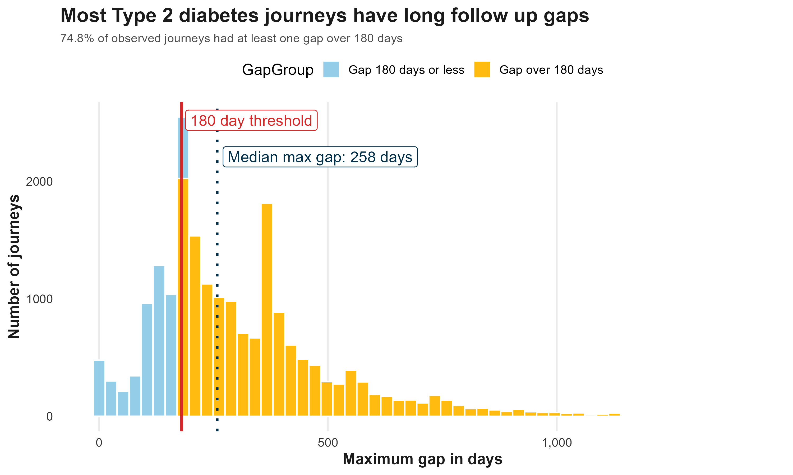
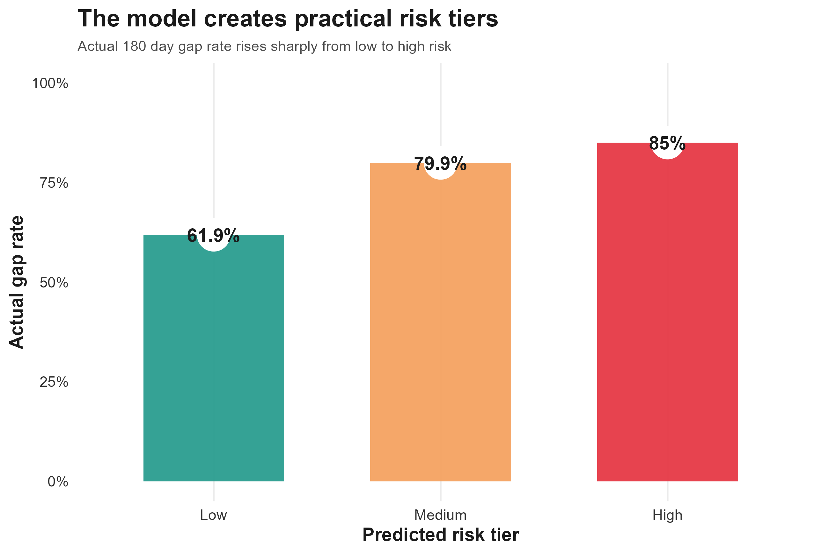
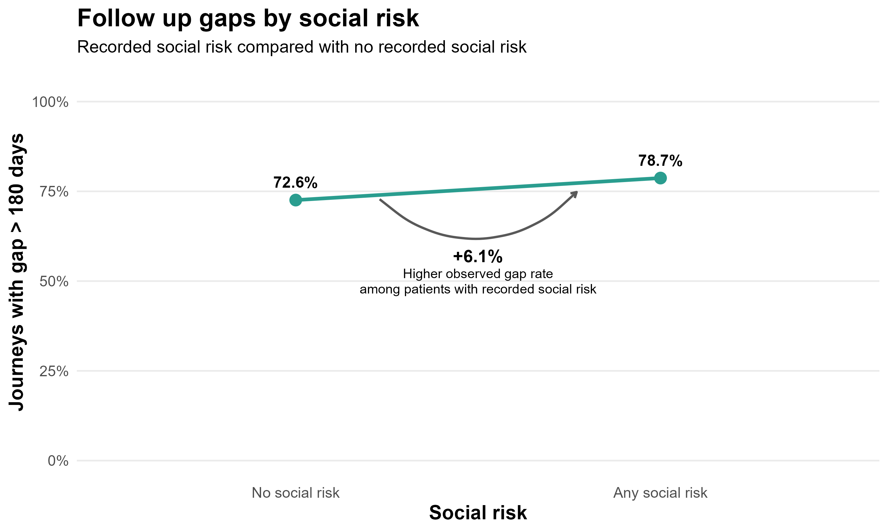

# Type 2 Diabetes Follow-Up Risk Model

ASA DataFest 2026 Finalist  
Team Fourcast

## Overview

This project predicts which Type 2 diabetes patients are at higher risk of missing a 180-day follow-up window. The goal was to support proactive scheduling and outreach by identifying patient journeys with a higher risk of delayed follow-up.

The project was completed for ASA DataFest 2026 using healthcare encounter data and presented as a finalist project.

## Example Output

## Business Problem

Healthcare teams often have limited time and resources. When many patients require follow-up care, staff need a way to prioritize outreach.

A risk model can help identify patients who are more likely to experience follow-up gaps. This allows healthcare teams to focus attention on higher-risk groups and potentially improve continuity of care.

## Data

The dataset contained healthcare encounter information related to Type 2 diabetes patient journeys.

The analysis focused on identifying eligible diabetes journeys and engineering features that could help predict whether a patient would experience a 180-day follow-up gap.

## Methods

- Data cleaning and preprocessing
- Joining encounter-level data into patient journey-level records
- Feature engineering across patient journeys
- Risk tier creation
- Random forest modeling
- Model evaluation using observed follow-up gap rates
- Translating model results into an outreach recommendation

## Key Results

- Engineered journey-level features across 20,409 eligible diabetes journeys.
- Trained a random forest model to stratify patients into risk tiers.
- Identified a high-risk tier with an 85.0% observed follow-up gap rate.
- Proposed a targeted follow-up protocol for proactive scheduling and patient outreach.
- Presented findings as part of ASA DataFest 2026 and reached finalist recognition.

## Risk Tier Output

## Social Risk Pattern

## Tools

- R
- DuckDB
- Data cleaning
- Feature engineering
- Random forest modeling
- Healthcare analytics

## What I Learned

This project strengthened my ability to work with messy healthcare data, engineer useful features, and connect model results to a practical operational recommendation.

It also improved my ability to explain technical findings to a non-technical audience under time pressure.

## Next Steps

- Test additional models such as logistic regression, gradient boosting, or regularized models
- Add more interpretability through feature importance or SHAP-style explanations
- Create a simple dashboard for risk tier monitoring
- Validate the model on future patient journeys
